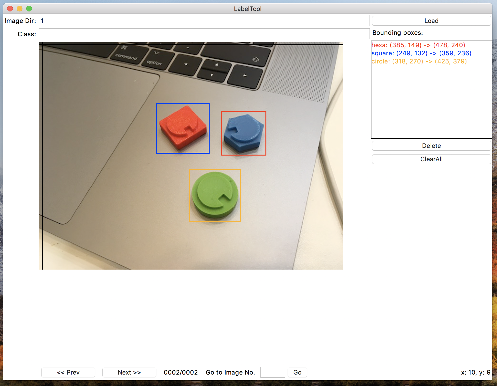

BBox-Label-Tool
===============

A simple tool for labeling object bounding boxes in images, implemented with Python Tkinter. This forked version is adapted for the Yolo Algorithm and creates XML files and permitts multi-class classification.

**Screenshot:**

Data Organization
-----------------
LabelTool  
|  
|--main.py   *# source code for the tool*  
|  
|--Images/   *# direcotry containing the images to be labeled, all images must have ".jpg" extension, case sensitive!*  
|  
|--Labels/   *# direcotry for the labeling results, will contain the ".xml" files*  

Environment
----------
- python 2.7
- python PIL (Pillow)

Run
-------
$ python main.py

Usage
-----
0. The current tool requires that **the images to be labeled reside in /Images/001, /Images/002, etc. You will need to modify the code if you want to label images elsewhere**.
1. Input a folder number (e.g, 1, 2, 5...), and click `Load`. The images in the folder, along with a few example results will be loaded.
2. To create a new bounding box, first write the correct class of the object, then left-click to select the first vertex. Moving the mouse to draw a rectangle, and left-click again to select the second vertex.
  - To cancel the bounding box while drawing, just press `<Esc>`.
  - To delete a existing bounding box, select it from the listbox, and click `Delete`.
  - To delete all existing bounding boxes in the image, simply click `ClearAll`.
3. After finishing one image, click `Next` to advance. Likewise, click `Prev` to reverse. Or, input an image id and click `Go` to navigate to the speficied image.
  - Be sure to click `Next` after finishing a image, or the result won't be saved. 
